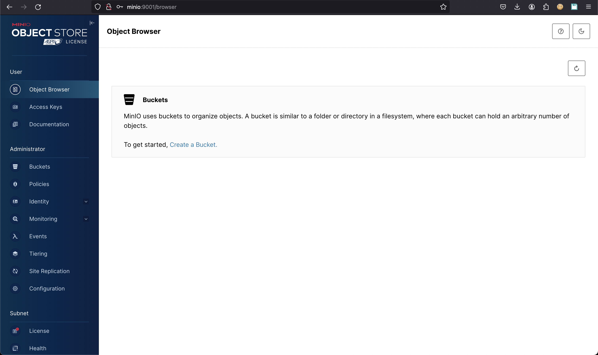
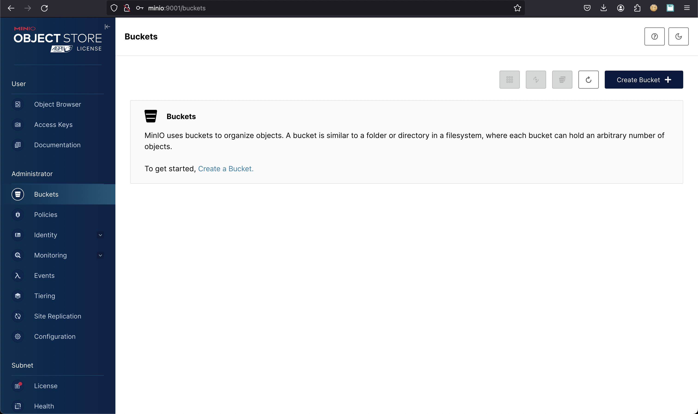
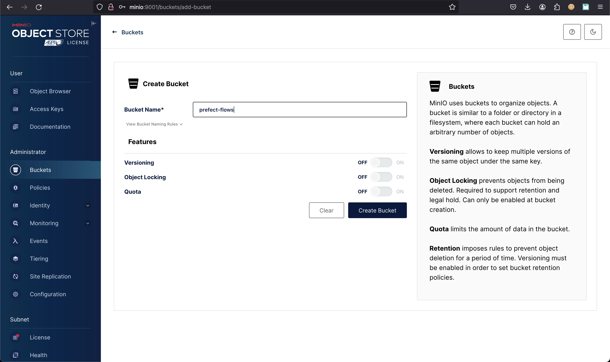
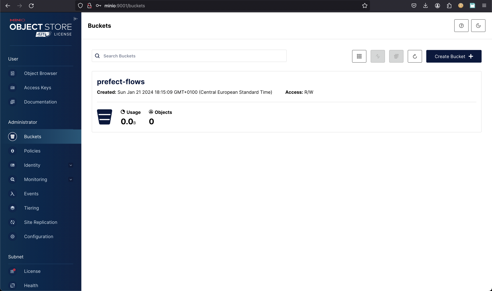
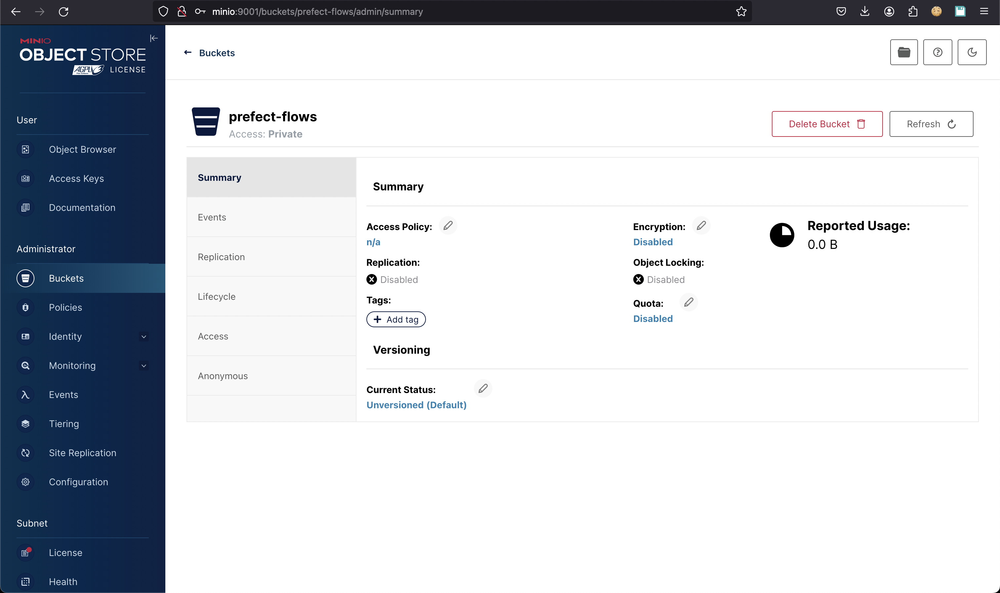
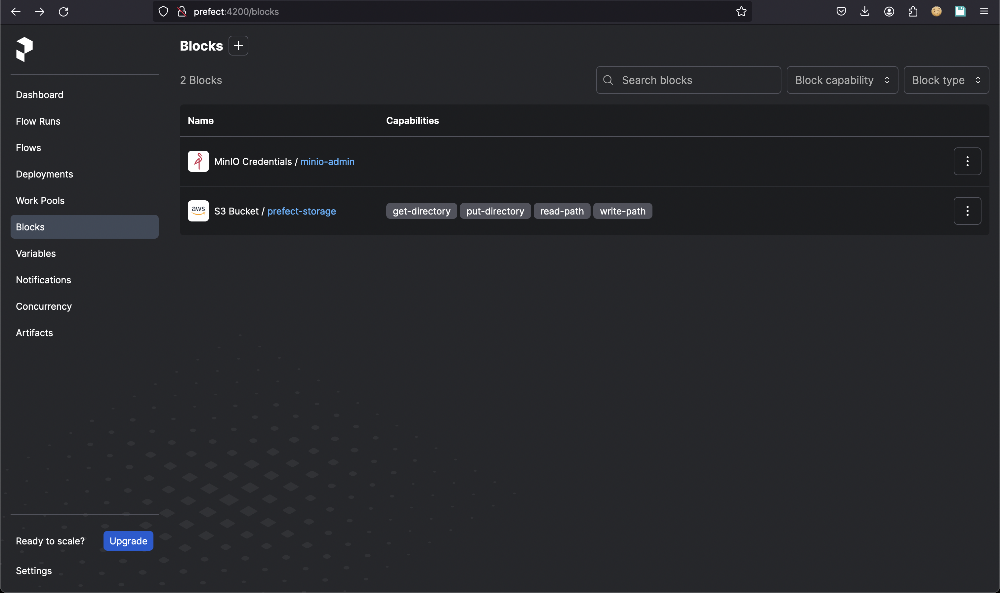
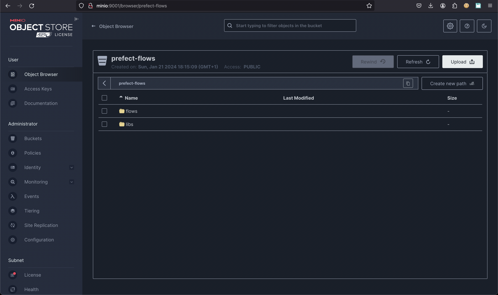
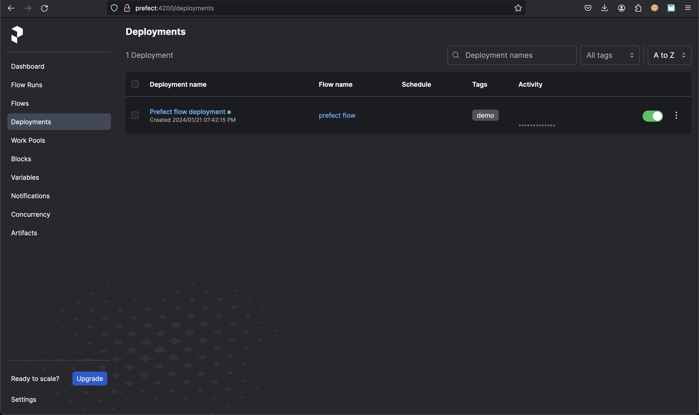

# Development

## How to get started

Let's introduce the journey for developers 🛫 to managing the ingestion process of cadaster data.

### Start a complete environment

The repository has batteries included to manage and monitor the workflows to ingest the data into the target
database. A Docker Compose script is provided to start the different components:

- *Prefect* with server and agents
- *Minio* to host the code and data
- A python virtual environment to deploy Prefect flows

!!! Note
    Please note that the `docker-compose-prefect.yml` file under `scripts/docker` is heavily influenced by this project <https://github.com/rpeden/prefect-docker-compose>. Kudos to [@rpeden](https://github.com/rpeden) for that.

#### Start the stack

All the services declared in the script `scripts/docker/docker-compose-prefect.yml` will be deployed and
can communicate within the internal network interface `prefect-network` defined in the compose file. Use the
following command `docker compose` to start the stack:

<!-- termynal -->
```shell
$ docker compose -f scripts/docker/docker-compose-prefect.yml --profile agent --profile server --profile queue --profile minio --profile cli up -d

[+] Running 12/12
 ✔ Network prefect-network                        Created                                                                                            0.0s 
 ✔ Volume "docker_db"                             Created                                                                                            0.0s 
 ✔ Volume "docker_minio"                          Created                                                                                            0.0s 
 ✔ Volume "docker_cli"                            Created                                                                                            0.0s 
 ✔ Volume "docker_prefect"                        Created                                                                                            0.0s 
 ✔ Container docker-minio-1                       Started                                                                                            0.1s 
 ✔ Container docker-cli-1                         Started                                                                                            0.1s 
 ✔ Container docker-db-1                          Started                                                                                            0.1s 
 ✔ Container docker-prefect-1                     Started                                                                                            0.1s 
 ✔ Container docker-prefect_agent_default-1       Started                                                                                            0.2s 
 ✔ Container docker-prefect_work_queue_catasto-1  Started                                                                                            0.2s 
 ✔ Container docker-prefect_agent_catasto-1       Started                                                                                            0.0s                                          0.1s 
```

#### Monitor the services status

All the services in the docker compose file have a profile that can be used to monitor only some of them.

<!-- termynal -->
```shell
$ docker compose -f scripts/docker/docker-compose-prefect.yml --profile agent --profile server --profile queue --profile --profile minio ps -a

NAME                                  IMAGE                                 COMMAND                  SERVICE                      CREATED         STATUS                          PORTS
docker-db-1                           postgres:15.2-alpine                  "docker-entrypoint.s…"   db                           2 minutes ago   Up 2 minutes                    0.0.0.0:5432->5432/tcp
docker-prefect-1                      prefecthq/prefect:2.14.15-python3.9   "/opt/prefect/entryp…"   prefect                      2 minutes ago   Up 2 minutes                    0.0.0.0:4200->4200/tcp
docker-prefect_agent_catasto-1        prefecthq/prefect:2.14.15-python3.9   "/opt/prefect/entryp…"   prefect_agent_catasto        2 minutes ago   Up 2 minutes                    
docker-prefect_agent_default-1        prefecthq/prefect:2.14.15-python3.9   "/opt/prefect/entryp…"   prefect_agent_default        2 minutes ago   Up 2 minutes                    
docker-prefect_work_queue_catasto-1   prefecthq/prefect:2.14.15-python3.9   "/opt/prefect/entryp…"   prefect_work_queue_catasto   2 minutes ago   Restarting (1) 51 seconds ago
```

### Access the GUI of Prefect and Minio

Prefect and Minio are made available in the host machine with their default ports:

- *Prefect* console is available on default port `4200` and doesn't require credentials;
- *Minio* admin console is available on default port `9001` and requires credentials. Admin user and password are the default `minioadmin/minioadmin`. Please change them in your production environment.

Optionally you can configure your local host file to use the same service name of the docker environment rather than `localhost`. In this case you can add these entries to your configuration. In `unix` based host machine edit the file `/etc/hosts`:

<!-- termynal -->
```shell
$ sudo vi /etc/hosts
# Add the following
127.0.0.1       prefect
127.0.0.1       minio
```

#### Access Minio

*Minio* admin console is available from the host machine after the above configuration at the following
URL: <http://minio:9000>.


The login page of the Minio administration console will be shown. Fill the credentials with the following default values:

- **username**: *minioadmin*
- **password**: *minioadmin*

and click on the `Login` button.



The buckets page won't show any bucket in the bucket list. We will see how to create a new bucket for the storage of Prefect flows.

#### Access Prefect

*Prefect* console is available from the host machine after the above configuration at the following URL: <http://prefect:4200>.


The dashboard page will be automatically loaded and display an empty situation at the beginning as well as the rest of the sections.

### Configure the storage and deployment of Prefect flows

A flow in Prefect can be executed from a local development environment or deployed and hosted remotely in a cloud object storage. For production it is recommended to configure a bucket where Prefect will store the flows code. Once a flow is deployed in Prefect there is a reference in a block where the code is located and how it can be executed. More information for Prefect deployments can be found [here](https://docs.prefect.io/latest/concepts/deployments/).
In our case, we would like to store the flows in a dedicated Minio bucket so that we can make the deployment in production easier.

#### Create the bucket for the flows storage

From the Minio administration console let's open the `Buckets` section on the left panel



then click on the `Create Bucket` button:



Enter a bucket name, i.e. `prefect-flows` and then click on the `Create Bucket` button. The bucket will be created and be shown in the bucket list:



For development and testing purposes let's make it publicly available. Click on the `prefect-flows` bucket and then click on the pencil icon 📝 close to `Access Policy` to edit the permission from `n/a` to `Public`:



Let's select `Public` from the dropdown list and finally click on the `Set` button. The `prefect-flows` bucket is now ready to store flows deployed in Prefect.

#### Deployment of a flow in Prefect

In the repository we placed a simple prefect flow. The code is in the python file `flows/demo.py` and the flow is named `prefect flow`. That name will be used to display the flow in Prefect after the deployment process. The code is very simple and doesn't require additional dependencies but it simulates a whole ETL process and prove that Prefect is working properly in development.

```python
from prefect import task, flow

# Define tasks using the @task decorator
@task(name="extract data", log_prints=True, tags="extract")
def extract_data():
    return [1, 2, 3, 4, 5]

@task(name="transform data", log_prints=True, tags="transform")
def transform_data(data):
    return [x * 2 for x in data]

@task(name="load data", log_prints=True, tags="load")
def load_data(transformed_data):
    print("Transformed Data:", transformed_data)

# Create a flow
@flow(name="prefect flow")
def prefect_flow():
    data = extract_data()
    transformed = transform_data(data)
    load_data(transformed)

if __name__ == "__main__":
    prefect_flow()
```

!!! Warning
    Despite you are accessing the Prefect GUI in your host machine, you have to remember that the Prefect API are only available in the docker network `prefect-network` of the composition. So the Prefect client must be configured within a container which is connected to that network.

The composition already provides a `cli` service to mount your local flows to the container and execute the deployment script . It's just a command away from the container execution of a bash shell where you can run the deployment script. Use the following command to go into the container:

<!-- termynal -->
```shell
$ docker compose -f scripts/docker/docker-compose-prefect.yml run cli

+pip install prefect-aws s3fs poetry
Collecting prefect-aws
  Downloading prefect_aws-0.4.7-py3-none-any.whl.metadata (3.7 kB)
Collecting s3fs
  Downloading s3fs-2023.12.2-py3-none-any.whl.metadata (1.6 kB)
Collecting poetry
  Downloading poetry-1.7.1-py3-none-any.whl.metadata (6.8 kB)
Collecting boto3>=1.24.53 (from prefect-aws)
  Downloading boto3-1.34.23-py3-none-any.whl.metadata (6.6 kB)
Collecting botocore>=1.27.53 (from prefect-aws)
  Downloading botocore-1.34.23-py3-none-any.whl.metadata (5.6 kB)
Collecting mypy-boto3-s3>=1.24.94 (from prefect-aws)
  Downloading mypy_boto3_s3-1.34.14-py3-none-any.whl.metadata (17 kB)
Collecting mypy-boto3-secretsmanager>=1.26.49 (from prefect-aws)
  Downloading mypy_boto3_secretsmanager-1.34.17-py3-none-any.whl.metadata (13 kB)
Requirement already satisfied: prefect>=2.14.10 in /usr/local/lib/python3.10/site-packages (from prefect-aws) (2.14.15)
Collecting tenacity>=8.0.0 (from prefect-aws)
  Downloading tenacity-8.2.3-py3-none-any.whl.metadata (1.0 kB)
Collecting aiobotocore<3.0.0,>=2.5.4 (from s3fs)
  Downloading aiobotocore-2.11.0-py3-none-any.whl.metadata (21 kB)
Requirement already satisfied: fsspec==2023.12.2 in /usr/local/lib/python3.10/site-packages (from s3fs) (2023.12.2)
Collecting aiohttp!=4.0.0a0,!=4.0.0a1 (from s3fs)
  Downloading aiohttp-3.9.1-cp310-cp310-manylinux_2_17_aarch64.manylinux2014_aarch64.whl.metadata (7.4 kB)
Collecting build<2.0.0,>=1.0.3 (from poetry)
  Downloading build-1.0.3-py3-none-any.whl.metadata (4.2 kB)
Collecting cachecontrol<0.14.0,>=0.13.0 (from cachecontrol[filecache]<0.14.0,>=0.13.0->poetry)
  Downloading cachecontrol-0.13.1-py3-none-any.whl.metadata (3.0 kB)
Collecting cleo<3.0.0,>=2.1.0 (from poetry)
  Downloading cleo-2.1.0-py3-none-any.whl.metadata (12 kB)
Collecting crashtest<0.5.0,>=0.4.1 (from poetry)
  Downloading crashtest-0.4.1-py3-none-any.whl (7.6 kB)
Collecting dulwich<0.22.0,>=0.21.2 (from poetry)
  Downloading dulwich-0.21.7-cp310-cp310-manylinux_2_17_aarch64.manylinux2014_aarch64.whl.metadata (4.3 kB)
Collecting fastjsonschema<3.0.0,>=2.18.0 (from poetry)
  Downloading fastjsonschema-2.19.1-py3-none-any.whl.metadata (2.1 kB)
Collecting installer<0.8.0,>=0.7.0 (from poetry)
  Downloading installer-0.7.0-py3-none-any.whl (453 kB)
     ━━━━━━━━━━━━━━━━━━━━━━━━━━━━━━━━━━━━━━━━ 453.8/453.8 kB 3.7 MB/s eta 0:00:00
Collecting keyring<25.0.0,>=24.0.0 (from poetry)
  Downloading keyring-24.3.0-py3-none-any.whl.metadata (20 kB)
Requirement already satisfied: packaging>=20.5 in /usr/local/lib/python3.10/site-packages (from poetry) (23.2)
Collecting pexpect<5.0.0,>=4.7.0 (from poetry)
  Downloading pexpect-4.9.0-py2.py3-none-any.whl.metadata (2.5 kB)
Collecting pkginfo<2.0.0,>=1.9.4 (from poetry)
  Downloading pkginfo-1.9.6-py3-none-any.whl (30 kB)
Collecting platformdirs<4.0.0,>=3.0.0 (from poetry)
  Downloading platformdirs-3.11.0-py3-none-any.whl.metadata (11 kB)
Collecting poetry-core==1.8.1 (from poetry)
  Using cached poetry_core-1.8.1-py3-none-any.whl.metadata (3.5 kB)
Collecting poetry-plugin-export<2.0.0,>=1.6.0 (from poetry)
  Downloading poetry_plugin_export-1.6.0-py3-none-any.whl.metadata (2.8 kB)
Collecting pyproject-hooks<2.0.0,>=1.0.0 (from poetry)
  Downloading pyproject_hooks-1.0.0-py3-none-any.whl (9.3 kB)
Requirement already satisfied: requests<3.0,>=2.26 in /usr/local/lib/python3.10/site-packages (from poetry) (2.31.0)
Collecting requests-toolbelt<2,>=0.9.1 (from poetry)
  Downloading requests_toolbelt-1.0.0-py2.py3-none-any.whl (54 kB)
     ━━━━━━━━━━━━━━━━━━━━━━━━━━━━━━━━━━━━━━━━ 54.5/54.5 kB 4.7 MB/s eta 0:00:00
Collecting shellingham<2.0,>=1.5 (from poetry)
  Downloading shellingham-1.5.4-py2.py3-none-any.whl.metadata (3.5 kB)
Collecting tomli<3.0.0,>=2.0.1 (from poetry)
  Downloading tomli-2.0.1-py3-none-any.whl (12 kB)
Collecting tomlkit<1.0.0,>=0.11.4 (from poetry)
  Downloading tomlkit-0.12.3-py3-none-any.whl.metadata (2.7 kB)
Collecting trove-classifiers>=2022.5.19 (from poetry)
  Downloading trove_classifiers-2024.1.8-py3-none-any.whl.metadata (2.2 kB)
Collecting virtualenv<21.0.0,>=20.23.0 (from poetry)
  Downloading virtualenv-20.25.0-py3-none-any.whl.metadata (4.5 kB)
Collecting botocore>=1.27.53 (from prefect-aws)
  Downloading botocore-1.34.22-py3-none-any.whl.metadata (5.6 kB)
Collecting wrapt<2.0.0,>=1.10.10 (from aiobotocore<3.0.0,>=2.5.4->s3fs)
  Downloading wrapt-1.16.0-cp310-cp310-manylinux_2_17_aarch64.manylinux2014_aarch64.whl.metadata (6.6 kB)
Collecting aioitertools<1.0.0,>=0.5.1 (from aiobotocore<3.0.0,>=2.5.4->s3fs)
  Downloading aioitertools-0.11.0-py3-none-any.whl (23 kB)
Requirement already satisfied: attrs>=17.3.0 in /usr/local/lib/python3.10/site-packages (from aiohttp!=4.0.0a0,!=4.0.0a1->s3fs) (23.2.0)
Collecting multidict<7.0,>=4.5 (from aiohttp!=4.0.0a0,!=4.0.0a1->s3fs)
  Downloading multidict-6.0.4-cp310-cp310-manylinux_2_17_aarch64.manylinux2014_aarch64.whl (116 kB)
     ━━━━━━━━━━━━━━━━━━━━━━━━━━━━━━━━━━━━━━━━ 116.6/116.6 kB 1.2 MB/s eta 0:00:00
Collecting yarl<2.0,>=1.0 (from aiohttp!=4.0.0a0,!=4.0.0a1->s3fs)
  Downloading yarl-1.9.4-cp310-cp310-manylinux_2_17_aarch64.manylinux2014_aarch64.whl.metadata (31 kB)
Collecting frozenlist>=1.1.1 (from aiohttp!=4.0.0a0,!=4.0.0a1->s3fs)
  Downloading frozenlist-1.4.1-cp310-cp310-manylinux_2_17_aarch64.manylinux2014_aarch64.whl.metadata (12 kB)
Collecting aiosignal>=1.1.2 (from aiohttp!=4.0.0a0,!=4.0.0a1->s3fs)
  Downloading aiosignal-1.3.1-py3-none-any.whl (7.6 kB)
Requirement already satisfied: async-timeout<5.0,>=4.0 in /usr/local/lib/python3.10/site-packages (from aiohttp!=4.0.0a0,!=4.0.0a1->s3fs) (4.0.3)
INFO: pip is looking at multiple versions of boto3 to determine which version is compatible with other requirements. This could take a while.
Collecting boto3>=1.24.53 (from prefect-aws)
  Downloading boto3-1.34.22-py3-none-any.whl.metadata (6.6 kB)
Collecting jmespath<2.0.0,>=0.7.1 (from boto3>=1.24.53->prefect-aws)
  Downloading jmespath-1.0.1-py3-none-any.whl (20 kB)
Collecting s3transfer<0.11.0,>=0.10.0 (from boto3>=1.24.53->prefect-aws)
  Downloading s3transfer-0.10.0-py3-none-any.whl.metadata (1.7 kB)
Requirement already satisfied: python-dateutil<3.0.0,>=2.1 in /usr/local/lib/python3.10/site-packages (from botocore>=1.27.53->prefect-aws) (2.8.2)
Requirement already satisfied: urllib3<2.1,>=1.25.4 in /usr/local/lib/python3.10/site-packages (from botocore>=1.27.53->prefect-aws) (1.26.18)
Collecting msgpack>=0.5.2 (from cachecontrol<0.14.0,>=0.13.0->cachecontrol[filecache]<0.14.0,>=0.13.0->poetry)
  Downloading msgpack-1.0.7-cp310-cp310-manylinux_2_17_aarch64.manylinux2014_aarch64.whl.metadata (9.1 kB)
Collecting filelock>=3.8.0 (from cachecontrol[filecache]<0.14.0,>=0.13.0->poetry)
  Downloading filelock-3.13.1-py3-none-any.whl.metadata (2.8 kB)
Collecting rapidfuzz<4.0.0,>=3.0.0 (from cleo<3.0.0,>=2.1.0->poetry)
  Downloading rapidfuzz-3.6.1-cp310-cp310-manylinux_2_17_aarch64.manylinux2014_aarch64.whl.metadata (11 kB)
Collecting jaraco.classes (from keyring<25.0.0,>=24.0.0->poetry)
  Downloading jaraco.classes-3.3.0-py3-none-any.whl.metadata (2.9 kB)
Collecting importlib-metadata>=4.11.4 (from keyring<25.0.0,>=24.0.0->poetry)
  Downloading importlib_metadata-7.0.1-py3-none-any.whl.metadata (4.9 kB)
Collecting SecretStorage>=3.2 (from keyring<25.0.0,>=24.0.0->poetry)
  Downloading SecretStorage-3.3.3-py3-none-any.whl (15 kB)
Collecting jeepney>=0.4.2 (from keyring<25.0.0,>=24.0.0->poetry)
  Downloading jeepney-0.8.0-py3-none-any.whl (48 kB)
     ━━━━━━━━━━━━━━━━━━━━━━━━━━━━━━━━━━━━━━━━ 48.4/48.4 kB 2.7 MB/s eta 0:00:00
Requirement already satisfied: typing-extensions>=4.1.0 in /usr/local/lib/python3.10/site-packages (from mypy-boto3-s3>=1.24.94->prefect-aws) (4.9.0)
Collecting ptyprocess>=0.5 (from pexpect<5.0.0,>=4.7.0->poetry)
  Downloading ptyprocess-0.7.0-py2.py3-none-any.whl (13 kB)
Requirement already satisfied: aiosqlite>=0.17.0 in /usr/local/lib/python3.10/site-packages (from prefect>=2.14.10->prefect-aws) (0.19.0)
Requirement already satisfied: alembic<2.0.0,>=1.7.5 in /usr/local/lib/python3.10/site-packages (from prefect>=2.14.10->prefect-aws) (1.13.1)
Requirement already satisfied: apprise<2.0.0,>=1.1.0 in /usr/local/lib/python3.10/site-packages (from prefect>=2.14.10->prefect-aws) (1.7.1)
Requirement already satisfied: asyncpg>=0.23 in /usr/local/lib/python3.10/site-packages (from prefect>=2.14.10->prefect-aws) (0.29.0)
Requirement already satisfied: click<8.2,>=8.0 in /usr/local/lib/python3.10/site-packages (from prefect>=2.14.10->prefect-aws) (8.1.7)
Requirement already satisfied: cryptography>=36.0.1 in /usr/local/lib/python3.10/site-packages (from prefect>=2.14.10->prefect-aws) (41.0.7)
Requirement already satisfied: dateparser<2.0.0,>=1.1.1 in /usr/local/lib/python3.10/site-packages (from prefect>=2.14.10->prefect-aws) (1.2.0)
Requirement already satisfied: docker<7.0,>=4.0 in /usr/local/lib/python3.10/site-packages (from prefect>=2.14.10->prefect-aws) (6.1.3)
Requirement already satisfied: graphviz>=0.20.1 in /usr/local/lib/python3.10/site-packages (from prefect>=2.14.10->prefect-aws) (0.20.1)
Requirement already satisfied: griffe>=0.20.0 in /usr/local/lib/python3.10/site-packages (from prefect>=2.14.10->prefect-aws) (0.38.1)
Requirement already satisfied: jinja2<4.0.0,>=3.0.0 in /usr/local/lib/python3.10/site-packages (from prefect>=2.14.10->prefect-aws) (3.1.3)
Requirement already satisfied: kubernetes<29.0.0,>=24.2.0 in /usr/local/lib/python3.10/site-packages (from prefect>=2.14.10->prefect-aws) (28.1.0)
Requirement already satisfied: pytz<2024,>=2021.1 in /usr/local/lib/python3.10/site-packages (from prefect>=2.14.10->prefect-aws) (2023.3.post1)
Requirement already satisfied: readchar<5.0.0,>=4.0.0 in /usr/local/lib/python3.10/site-packages (from prefect>=2.14.10->prefect-aws) (4.0.5)
Requirement already satisfied: sqlalchemy!=1.4.33,<3.0.0,>=1.4.22 in /usr/local/lib/python3.10/site-packages (from sqlalchemy[asyncio]!=1.4.33,<3.0.0,>=1.4.22->prefect>=2.14.10->prefect-aws) (2.0.25)
Requirement already satisfied: typer>=0.4.2 in /usr/local/lib/python3.10/site-packages (from prefect>=2.14.10->prefect-aws) (0.9.0)
Requirement already satisfied: anyio<4.0.0,>=3.7.1 in /usr/local/lib/python3.10/site-packages (from prefect>=2.14.10->prefect-aws) (3.7.1)
Requirement already satisfied: asgi-lifespan<3.0,>=1.0 in /usr/local/lib/python3.10/site-packages (from prefect>=2.14.10->prefect-aws) (2.1.0)
Requirement already satisfied: cachetools<6.0,>=5.3 in /usr/local/lib/python3.10/site-packages (from prefect>=2.14.10->prefect-aws) (5.3.2)
Requirement already satisfied: cloudpickle<4.0,>=2.0 in /usr/local/lib/python3.10/site-packages (from prefect>=2.14.10->prefect-aws) (3.0.0)
Requirement already satisfied: coolname<3.0.0,>=1.0.4 in /usr/local/lib/python3.10/site-packages (from prefect>=2.14.10->prefect-aws) (2.2.0)
Requirement already satisfied: croniter<3.0.0,>=1.0.12 in /usr/local/lib/python3.10/site-packages (from prefect>=2.14.10->prefect-aws) (2.0.1)
Requirement already satisfied: httpcore<2.0.0,>=0.15.0 in /usr/local/lib/python3.10/site-packages (from prefect>=2.14.10->prefect-aws) (1.0.2)
Requirement already satisfied: httpx!=0.23.2,>=0.23 in /usr/local/lib/python3.10/site-packages (from httpx[http2]!=0.23.2,>=0.23->prefect>=2.14.10->prefect-aws) (0.26.0)
Requirement already satisfied: jsonpatch<2.0,>=1.32 in /usr/local/lib/python3.10/site-packages (from prefect>=2.14.10->prefect-aws) (1.33)
Requirement already satisfied: jsonschema<5.0.0,>=3.2.0 in /usr/local/lib/python3.10/site-packages (from prefect>=2.14.10->prefect-aws) (4.20.0)
Requirement already satisfied: orjson<4.0,>=3.7 in /usr/local/lib/python3.10/site-packages (from prefect>=2.14.10->prefect-aws) (3.9.10)
Requirement already satisfied: pathspec>=0.8.0 in /usr/local/lib/python3.10/site-packages (from prefect>=2.14.10->prefect-aws) (0.12.1)
Requirement already satisfied: pydantic!=2.0.0,!=2.0.1,!=2.1.0,<3.0.0,>=1.10.0 in /usr/local/lib/python3.10/site-packages (from pydantic[email]!=2.0.0,!=2.0.1,!=2.1.0,<3.0.0,>=1.10.0->prefect>=2.14.10->prefect-aws) (2.5.3)
Requirement already satisfied: python-slugify<9.0,>=5.0 in /usr/local/lib/python3.10/site-packages (from prefect>=2.14.10->prefect-aws) (8.0.1)
Requirement already satisfied: pyyaml<7.0.0,>=5.4.1 in /usr/local/lib/python3.10/site-packages (from prefect>=2.14.10->prefect-aws) (6.0.1)
Requirement already satisfied: rich<14.0,>=11.0 in /usr/local/lib/python3.10/site-packages (from prefect>=2.14.10->prefect-aws) (13.7.0)
Requirement already satisfied: ruamel.yaml>=0.17.0 in /usr/local/lib/python3.10/site-packages (from prefect>=2.14.10->prefect-aws) (0.18.5)
Requirement already satisfied: sniffio<2.0.0,>=1.3.0 in /usr/local/lib/python3.10/site-packages (from prefect>=2.14.10->prefect-aws) (1.3.0)
Requirement already satisfied: starlette<0.33.0,>=0.27.0 in /usr/local/lib/python3.10/site-packages (from prefect>=2.14.10->prefect-aws) (0.32.0.post1)
Requirement already satisfied: toml>=0.10.0 in /usr/local/lib/python3.10/site-packages (from prefect>=2.14.10->prefect-aws) (0.10.2)
Requirement already satisfied: ujson<6.0.0,>=5.8.0 in /usr/local/lib/python3.10/site-packages (from prefect>=2.14.10->prefect-aws) (5.9.0)
Requirement already satisfied: uvicorn>=0.14.0 in /usr/local/lib/python3.10/site-packages (from prefect>=2.14.10->prefect-aws) (0.25.0)
Requirement already satisfied: websockets<13.0,>=10.4 in /usr/local/lib/python3.10/site-packages (from prefect>=2.14.10->prefect-aws) (12.0)
Requirement already satisfied: pendulum<3.0 in /usr/local/lib/python3.10/site-packages (from prefect>=2.14.10->prefect-aws) (2.1.2)
Requirement already satisfied: charset-normalizer<4,>=2 in /usr/local/lib/python3.10/site-packages (from requests<3.0,>=2.26->poetry) (3.3.2)
Requirement already satisfied: idna<4,>=2.5 in /usr/local/lib/python3.10/site-packages (from requests<3.0,>=2.26->poetry) (3.6)
Requirement already satisfied: certifi>=2017.4.17 in /usr/local/lib/python3.10/site-packages (from requests<3.0,>=2.26->poetry) (2023.11.17)
Collecting distlib<1,>=0.3.7 (from virtualenv<21.0.0,>=20.23.0->poetry)
  Downloading distlib-0.3.8-py2.py3-none-any.whl.metadata (5.1 kB)
Requirement already satisfied: Mako in /usr/local/lib/python3.10/site-packages (from alembic<2.0.0,>=1.7.5->prefect>=2.14.10->prefect-aws) (1.3.0)
Requirement already satisfied: exceptiongroup in /usr/local/lib/python3.10/site-packages (from anyio<4.0.0,>=3.7.1->prefect>=2.14.10->prefect-aws) (1.2.0)
Requirement already satisfied: requests-oauthlib in /usr/local/lib/python3.10/site-packages (from apprise<2.0.0,>=1.1.0->prefect>=2.14.10->prefect-aws) (1.3.1)
Requirement already satisfied: markdown in /usr/local/lib/python3.10/site-packages (from apprise<2.0.0,>=1.1.0->prefect>=2.14.10->prefect-aws) (3.5.2)
Requirement already satisfied: cffi>=1.12 in /usr/local/lib/python3.10/site-packages (from cryptography>=36.0.1->prefect>=2.14.10->prefect-aws) (1.16.0)
Requirement already satisfied: regex!=2019.02.19,!=2021.8.27 in /usr/local/lib/python3.10/site-packages (from dateparser<2.0.0,>=1.1.1->prefect>=2.14.10->prefect-aws) (2023.12.25)
Requirement already satisfied: tzlocal in /usr/local/lib/python3.10/site-packages (from dateparser<2.0.0,>=1.1.1->prefect>=2.14.10->prefect-aws) (5.2)
Requirement already satisfied: websocket-client>=0.32.0 in /usr/local/lib/python3.10/site-packages (from docker<7.0,>=4.0->prefect>=2.14.10->prefect-aws) (1.7.0)
Requirement already satisfied: colorama>=0.4 in /usr/local/lib/python3.10/site-packages (from griffe>=0.20.0->prefect>=2.14.10->prefect-aws) (0.4.6)
Requirement already satisfied: h11<0.15,>=0.13 in /usr/local/lib/python3.10/site-packages (from httpcore<2.0.0,>=0.15.0->prefect>=2.14.10->prefect-aws) (0.14.0)
Requirement already satisfied: h2<5,>=3 in /usr/local/lib/python3.10/site-packages (from httpx[http2]!=0.23.2,>=0.23->prefect>=2.14.10->prefect-aws) (4.1.0)
Collecting zipp>=0.5 (from importlib-metadata>=4.11.4->keyring<25.0.0,>=24.0.0->poetry)
  Downloading zipp-3.17.0-py3-none-any.whl.metadata (3.7 kB)
Requirement already satisfied: MarkupSafe>=2.0 in /usr/local/lib/python3.10/site-packages (from jinja2<4.0.0,>=3.0.0->prefect>=2.14.10->prefect-aws) (2.1.3)
Requirement already satisfied: jsonpointer>=1.9 in /usr/local/lib/python3.10/site-packages (from jsonpatch<2.0,>=1.32->prefect>=2.14.10->prefect-aws) (2.4)
Requirement already satisfied: jsonschema-specifications>=2023.03.6 in /usr/local/lib/python3.10/site-packages (from jsonschema<5.0.0,>=3.2.0->prefect>=2.14.10->prefect-aws) (2023.12.1)
Requirement already satisfied: referencing>=0.28.4 in /usr/local/lib/python3.10/site-packages (from jsonschema<5.0.0,>=3.2.0->prefect>=2.14.10->prefect-aws) (0.32.1)
Requirement already satisfied: rpds-py>=0.7.1 in /usr/local/lib/python3.10/site-packages (from jsonschema<5.0.0,>=3.2.0->prefect>=2.14.10->prefect-aws) (0.16.2)
Requirement already satisfied: six>=1.9.0 in /usr/local/lib/python3.10/site-packages (from kubernetes<29.0.0,>=24.2.0->prefect>=2.14.10->prefect-aws) (1.16.0)
Requirement already satisfied: google-auth>=1.0.1 in /usr/local/lib/python3.10/site-packages (from kubernetes<29.0.0,>=24.2.0->prefect>=2.14.10->prefect-aws) (2.26.2)
Requirement already satisfied: oauthlib>=3.2.2 in /usr/local/lib/python3.10/site-packages (from kubernetes<29.0.0,>=24.2.0->prefect>=2.14.10->prefect-aws) (3.2.2)
Requirement already satisfied: pytzdata>=2020.1 in /usr/local/lib/python3.10/site-packages (from pendulum<3.0->prefect>=2.14.10->prefect-aws) (2020.1)
Requirement already satisfied: annotated-types>=0.4.0 in /usr/local/lib/python3.10/site-packages (from pydantic!=2.0.0,!=2.0.1,!=2.1.0,<3.0.0,>=1.10.0->pydantic[email]!=2.0.0,!=2.0.1,!=2.1.0,<3.0.0,>=1.10.0->prefect>=2.14.10->prefect-aws) (0.6.0)
Requirement already satisfied: pydantic-core==2.14.6 in /usr/local/lib/python3.10/site-packages (from pydantic!=2.0.0,!=2.0.1,!=2.1.0,<3.0.0,>=1.10.0->pydantic[email]!=2.0.0,!=2.0.1,!=2.1.0,<3.0.0,>=1.10.0->prefect>=2.14.10->prefect-aws) (2.14.6)
Requirement already satisfied: email-validator>=2.0.0 in /usr/local/lib/python3.10/site-packages (from pydantic[email]!=2.0.0,!=2.0.1,!=2.1.0,<3.0.0,>=1.10.0->prefect>=2.14.10->prefect-aws) (2.1.0.post1)
Requirement already satisfied: text-unidecode>=1.3 in /usr/local/lib/python3.10/site-packages (from python-slugify<9.0,>=5.0->prefect>=2.14.10->prefect-aws) (1.3)
Requirement already satisfied: setuptools>=41.0 in /usr/local/lib/python3.10/site-packages (from readchar<5.0.0,>=4.0.0->prefect>=2.14.10->prefect-aws) (69.0.3)
Requirement already satisfied: markdown-it-py>=2.2.0 in /usr/local/lib/python3.10/site-packages (from rich<14.0,>=11.0->prefect>=2.14.10->prefect-aws) (3.0.0)
Requirement already satisfied: pygments<3.0.0,>=2.13.0 in /usr/local/lib/python3.10/site-packages (from rich<14.0,>=11.0->prefect>=2.14.10->prefect-aws) (2.17.2)
Requirement already satisfied: ruamel.yaml.clib>=0.2.7 in /usr/local/lib/python3.10/site-packages (from ruamel.yaml>=0.17.0->prefect>=2.14.10->prefect-aws) (0.2.8)
Requirement already satisfied: greenlet!=0.4.17 in /usr/local/lib/python3.10/site-packages (from sqlalchemy!=1.4.33,<3.0.0,>=1.4.22->sqlalchemy[asyncio]!=1.4.33,<3.0.0,>=1.4.22->prefect>=2.14.10->prefect-aws) (3.0.3)
Collecting more-itertools (from jaraco.classes->keyring<25.0.0,>=24.0.0->poetry)
  Downloading more_itertools-10.2.0-py3-none-any.whl.metadata (34 kB)
Requirement already satisfied: pycparser in /usr/local/lib/python3.10/site-packages (from cffi>=1.12->cryptography>=36.0.1->prefect>=2.14.10->prefect-aws) (2.21)
Requirement already satisfied: dnspython>=2.0.0 in /usr/local/lib/python3.10/site-packages (from email-validator>=2.0.0->pydantic[email]!=2.0.0,!=2.0.1,!=2.1.0,<3.0.0,>=1.10.0->prefect>=2.14.10->prefect-aws) (2.4.2)
Requirement already satisfied: pyasn1-modules>=0.2.1 in /usr/local/lib/python3.10/site-packages (from google-auth>=1.0.1->kubernetes<29.0.0,>=24.2.0->prefect>=2.14.10->prefect-aws) (0.3.0)
Requirement already satisfied: rsa<5,>=3.1.4 in /usr/local/lib/python3.10/site-packages (from google-auth>=1.0.1->kubernetes<29.0.0,>=24.2.0->prefect>=2.14.10->prefect-aws) (4.9)
Requirement already satisfied: hyperframe<7,>=6.0 in /usr/local/lib/python3.10/site-packages (from h2<5,>=3->httpx[http2]!=0.23.2,>=0.23->prefect>=2.14.10->prefect-aws) (6.0.1)
Requirement already satisfied: hpack<5,>=4.0 in /usr/local/lib/python3.10/site-packages (from h2<5,>=3->httpx[http2]!=0.23.2,>=0.23->prefect>=2.14.10->prefect-aws) (4.0.0)
Requirement already satisfied: mdurl~=0.1 in /usr/local/lib/python3.10/site-packages (from markdown-it-py>=2.2.0->rich<14.0,>=11.0->prefect>=2.14.10->prefect-aws) (0.1.2)
Requirement already satisfied: pyasn1<0.6.0,>=0.4.6 in /usr/local/lib/python3.10/site-packages (from pyasn1-modules>=0.2.1->google-auth>=1.0.1->kubernetes<29.0.0,>=24.2.0->prefect>=2.14.10->prefect-aws) (0.5.1)
Downloading prefect_aws-0.4.7-py3-none-any.whl (59 kB)
   ━━━━━━━━━━━━━━━━━━━━━━━━━━━━━━━━━━━━━━━━ 59.9/59.9 kB 4.4 MB/s eta 0:00:00
Downloading s3fs-2023.12.2-py3-none-any.whl (28 kB)
Downloading poetry-1.7.1-py3-none-any.whl (235 kB)
   ━━━━━━━━━━━━━━━━━━━━━━━━━━━━━━━━━━━━━━━━ 236.0/236.0 kB 2.7 MB/s eta 0:00:00
Using cached poetry_core-1.8.1-py3-none-any.whl (306 kB)
Downloading aiobotocore-2.11.0-py3-none-any.whl (76 kB)
   ━━━━━━━━━━━━━━━━━━━━━━━━━━━━━━━━━━━━━━━━ 76.1/76.1 kB 2.3 MB/s eta 0:00:00
Downloading aiohttp-3.9.1-cp310-cp310-manylinux_2_17_aarch64.manylinux2014_aarch64.whl (1.2 MB)
   ━━━━━━━━━━━━━━━━━━━━━━━━━━━━━━━━━━━━━━━━ 1.2/1.2 MB 2.5 MB/s eta 0:00:00
Downloading boto3-1.34.22-py3-none-any.whl (139 kB)
   ━━━━━━━━━━━━━━━━━━━━━━━━━━━━━━━━━━━━━━━━ 139.3/139.3 kB 2.0 MB/s eta 0:00:00
Downloading botocore-1.34.22-py3-none-any.whl (11.9 MB)
   ━━━━━━━━━━━━━━━━━━━━━━━━━━━━━━━━━━━━━━━━ 11.9/11.9 MB 4.9 MB/s eta 0:00:00
Downloading build-1.0.3-py3-none-any.whl (18 kB)
Downloading cachecontrol-0.13.1-py3-none-any.whl (22 kB)
Downloading cleo-2.1.0-py3-none-any.whl (78 kB)
   ━━━━━━━━━━━━━━━━━━━━━━━━━━━━━━━━━━━━━━━━ 78.7/78.7 kB 5.2 MB/s eta 0:00:00
Downloading dulwich-0.21.7-cp310-cp310-manylinux_2_17_aarch64.manylinux2014_aarch64.whl (516 kB)
   ━━━━━━━━━━━━━━━━━━━━━━━━━━━━━━━━━━━━━━━━ 516.7/516.7 kB 6.2 MB/s eta 0:00:00
Downloading fastjsonschema-2.19.1-py3-none-any.whl (23 kB)
Downloading keyring-24.3.0-py3-none-any.whl (38 kB)
Downloading mypy_boto3_s3-1.34.14-py3-none-any.whl (82 kB)
   ━━━━━━━━━━━━━━━━━━━━━━━━━━━━━━━━━━━━━━━━ 82.7/82.7 kB 4.1 MB/s eta 0:00:00
Downloading mypy_boto3_secretsmanager-1.34.17-py3-none-any.whl (26 kB)
Downloading pexpect-4.9.0-py2.py3-none-any.whl (63 kB)
   ━━━━━━━━━━━━━━━━━━━━━━━━━━━━━━━━━━━━━━━━ 63.8/63.8 kB 3.6 MB/s eta 0:00:00
Downloading platformdirs-3.11.0-py3-none-any.whl (17 kB)
Downloading poetry_plugin_export-1.6.0-py3-none-any.whl (10 kB)
Downloading shellingham-1.5.4-py2.py3-none-any.whl (9.8 kB)
Downloading tenacity-8.2.3-py3-none-any.whl (24 kB)
Downloading tomlkit-0.12.3-py3-none-any.whl (37 kB)
Downloading trove_classifiers-2024.1.8-py3-none-any.whl (13 kB)
Downloading virtualenv-20.25.0-py3-none-any.whl (3.8 MB)
   ━━━━━━━━━━━━━━━━━━━━━━━━━━━━━━━━━━━━━━━━ 3.8/3.8 MB 4.0 MB/s eta 0:00:00
Downloading distlib-0.3.8-py2.py3-none-any.whl (468 kB)
   ━━━━━━━━━━━━━━━━━━━━━━━━━━━━━━━━━━━━━━━━ 468.9/468.9 kB 4.1 MB/s eta 0:00:00
Downloading filelock-3.13.1-py3-none-any.whl (11 kB)
Downloading frozenlist-1.4.1-cp310-cp310-manylinux_2_17_aarch64.manylinux2014_aarch64.whl (238 kB)
   ━━━━━━━━━━━━━━━━━━━━━━━━━━━━━━━━━━━━━━━━ 238.6/238.6 kB 5.3 MB/s eta 0:00:00
Downloading importlib_metadata-7.0.1-py3-none-any.whl (23 kB)
Downloading msgpack-1.0.7-cp310-cp310-manylinux_2_17_aarch64.manylinux2014_aarch64.whl (522 kB)
   ━━━━━━━━━━━━━━━━━━━━━━━━━━━━━━━━━━━━━━━━ 522.4/522.4 kB 4.9 MB/s eta 0:00:00
Downloading rapidfuzz-3.6.1-cp310-cp310-manylinux_2_17_aarch64.manylinux2014_aarch64.whl (1.6 MB)
   ━━━━━━━━━━━━━━━━━━━━━━━━━━━━━━━━━━━━━━━━ 1.6/1.6 MB 5.9 MB/s eta 0:00:00
Downloading s3transfer-0.10.0-py3-none-any.whl (82 kB)
   ━━━━━━━━━━━━━━━━━━━━━━━━━━━━━━━━━━━━━━━━ 82.1/82.1 kB 3.2 MB/s eta 0:00:00
Downloading wrapt-1.16.0-cp310-cp310-manylinux_2_17_aarch64.manylinux2014_aarch64.whl (80 kB)
   ━━━━━━━━━━━━━━━━━━━━━━━━━━━━━━━━━━━━━━━━ 80.4/80.4 kB 5.8 MB/s eta 0:00:00
Downloading yarl-1.9.4-cp310-cp310-manylinux_2_17_aarch64.manylinux2014_aarch64.whl (297 kB)
   ━━━━━━━━━━━━━━━━━━━━━━━━━━━━━━━━━━━━━━━━ 297.7/297.7 kB 5.0 MB/s eta 0:00:00
Downloading jaraco.classes-3.3.0-py3-none-any.whl (5.9 kB)
Downloading zipp-3.17.0-py3-none-any.whl (7.4 kB)
Downloading more_itertools-10.2.0-py3-none-any.whl (57 kB)
   ━━━━━━━━━━━━━━━━━━━━━━━━━━━━━━━━━━━━━━━━ 57.0/57.0 kB 13.5 MB/s eta 0:00:00
Installing collected packages: trove-classifiers, ptyprocess, fastjsonschema, distlib, zipp, wrapt, tomlkit, tomli, tenacity, shellingham, rapidfuzz, poetry-core, platformdirs, pkginfo, pexpect, mypy-boto3-secretsmanager, mypy-boto3-s3, multidict, msgpack, more-itertools, jmespath, jeepney, installer, frozenlist, filelock, dulwich, crashtest, aioitertools, yarl, virtualenv, requests-toolbelt, pyproject-hooks, jaraco.classes, importlib-metadata, cleo, cachecontrol, botocore, aiosignal, SecretStorage, s3transfer, build, aiohttp, keyring, boto3, aiobotocore, s3fs, prefect-aws, poetry-plugin-export, poetry
Successfully installed SecretStorage-3.3.3 aiobotocore-2.11.0 aiohttp-3.9.1 aioitertools-0.11.0 aiosignal-1.3.1 boto3-1.34.22 botocore-1.34.22 build-1.0.3 cachecontrol-0.13.1 cleo-2.1.0 crashtest-0.4.1 distlib-0.3.8 dulwich-0.21.7 fastjsonschema-2.19.1 filelock-3.13.1 frozenlist-1.4.1 importlib-metadata-7.0.1 installer-0.7.0 jaraco.classes-3.3.0 jeepney-0.8.0 jmespath-1.0.1 keyring-24.3.0 more-itertools-10.2.0 msgpack-1.0.7 multidict-6.0.4 mypy-boto3-s3-1.34.14 mypy-boto3-secretsmanager-1.34.17 pexpect-4.9.0 pkginfo-1.9.6 platformdirs-3.11.0 poetry-1.7.1 poetry-core-1.8.1 poetry-plugin-export-1.6.0 prefect-aws-0.4.7 ptyprocess-0.7.0 pyproject-hooks-1.0.0 rapidfuzz-3.6.1 requests-toolbelt-1.0.0 s3fs-2023.12.2 s3transfer-0.10.0 shellingham-1.5.4 tenacity-8.2.3 tomli-2.0.1 tomlkit-0.12.3 trove-classifiers-2024.1.8 virtualenv-20.25.0 wrapt-1.16.0 yarl-1.9.4 zipp-3.17.0
WARNING: Running pip as the 'root' user can result in broken permissions and conflicting behaviour with the system package manager. It is recommended to use a virtual environment instead: https://pip.pypa.io/warnings/venv

[notice] A new release of pip is available: 23.3.1 -> 23.3.2
[notice] To update, run: pip install --upgrade pip
root@44e5f45ec73e:~/catasto# 
```

- The first step is to configure the `prefect` client python package to use the following Prefect API endpoint <http://prefect:4200/api> which is made available by the `prefect` service in the composition.

!!! Tip
    This project is managing python configuration and dependencies through `poetry` so it is recommended to use the virtual environment from Poetry rather than the `prefect` python package installed globally by the Docker container.
    For production environments the project will make the python dependencies available from PyPI so that the container at runtime will install these additional dependencies in the Prefect image.

- The second step is to install the python dependencies in the Docker container:

<!-- termynal -->
```shell
$ poetry install

... # not displayed to save space
  • Installing prefect (2.14.16)
  • Installing prompt-toolkit (3.0.43)
  • Installing pymdown-extensions (10.7)
  • Installing stack-data (0.6.3)
  • Installing tenacity (8.2.3)
  • Installing ipython (8.20.0)
  • Installing mkdocs-material (9.5.4)
  • Installing prefect-aws (0.4.7)
  • Installing pyfiglet (0.8.post1)
  • Installing s3fs (2023.12.2)
  • Installing sister (0.1.0 /root/catasto/libs/src/sister)
  • Installing termynal (0.11.1)
  • Installing smidt (0.1.0 /root/catasto/libs/src/smidt)

Installing the current project: catasto-ingest (0.1.0)
```

- The third step is to activate the virtual environment:

<!-- termynal -->
```shell
$ poetry shell

Spawning shell within /root/catasto/.venv
root@44e5f45ec73e:~/catasto# . /root/catasto/.venv/bin/activate
(catasto-ingest-py3.10) root@44e5f45ec73e:~/catasto#
```

- If your shell doesn't have the following environment variable set to `PREFECT_API_URL=http://prefect:4200/api` you have to configure it yourself by running:

<!-- termynal -->
```shell
(catasto-ingest-py3.10) root@44e5f45ec73e:~/catasto# prefect config set PREFECT_API_URL=http://prefect:4200/api

Set 'PREFECT_API_URL' to 'http://prefect:4200/api'.
PREFECT_API_URL is also set by an environment variable which will override your config value. Run `unset PREFECT_API_URL` to clear it.
Updated profile 'default'.
```

For the `demo.py` flow we have already created a deployment script `flows/deployments/demo_deployment.py` in python so you have to just execute it:

<!-- termynal -->
```shell
(catasto-ingest-py3.10) root@44e5f45ec73e:~/catasto# python flows/deployments/demo_deployment.py

```

If everything went well then a couple of Prefect blocks, namely `minio-admin` and `prefect-storage` should be available in the Prefect console at the following URL: <http://prefect:4200/blocks>



Also, the demo flow code should be available in the `prefect-flows` bucket at the following URL: <http://minio:9001/browser/prefect-flows>



The deployment we'll be available and is ready to be executed now in the Prefect `Deployments` menu:



### Restart the stack from scratch

If you want to restart the stack with everything clean then you should use the following command which removes the volumes for each service:

<!-- termynal -->
```shell
docker compose -f scripts/docker/docker-compose-prefect.yml --profile agent --profile server --profile queue --profile minio --profile cli down -v --remove-orphans

[+] Running 11/11
 ✔ Container docker-prefect_agent_catasto-1       Removed                                                                                            0.7s 
 ✔ Container docker-prefect_agent_default-1       Removed                                                                                            0.6s 
 ✔ Container docker-minio-1                       Removed                                                                                            0.2s 
 ✔ Container docker-prefect_work_queue_catasto-1  Removed                                                                                            0.0s 
 ✔ Container docker-prefect-1                     Removed                                                                                            2.2s 
 ✔ Container docker-db-1                          Removed                                                                                            0.2s 
 ✔ Volume docker_db                               Removed                                                                                            0.4s 
 ✔ Volume docker_minio                            Removed                                                                                            0.0s 
 ✔ Volume docker_cli                              Removed                                                                                            0.4s 
 ✔ Volume docker_prefect                          Removed                                                                                            0.4s 
 ✔ Network prefect-network                        Removed                                                                                            0.1s 
```
