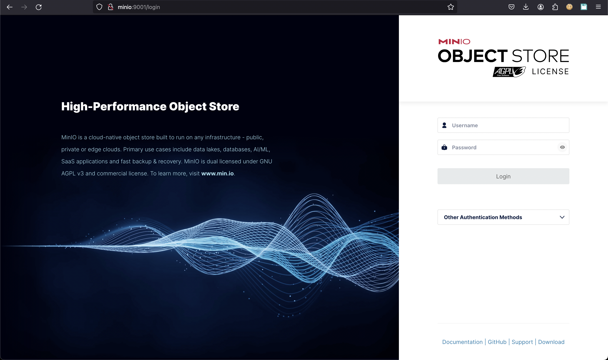

# Development

## How to get started

Let's introduce the journey for developers 🛫 to managing the ingestion process of cadaster data.

### Start a complete environment

The repository has batteries included to manage and monitor the workflows to ingest the data into the target
database. A Docker Compose script is provided to start the different components:

- *Prefect* with server and agents
- *Minio* to host the code and data
- A python virtual environment to deploy Prefect flows

!!! Note
    Please note that the `docker-compose-prefect.yml` file under `scripts/docker` is heavily influenced by this project <https://github.com/rpeden/prefect-docker-compose>. Kudos to [@rpeden](https://github.com/rpeden) for that.

#### Start the stack

All the services declared in the script `scripts/docker/docker-compose-prefect.yml` will be deployed and
can communicate within the internal network interface `prefect-network` defined in the compose file. Use the
following command `docker compose` to start the stack:

<!-- termynal -->
```shell
$ docker compose -f scripts/docker/docker-compose-prefect.yml --profile agent --profile server --profile queue --profile minio --profile cli up -d

[+] Running 12/12
 ✔ Network prefect-network                        Created                                                                                            0.0s 
 ✔ Volume "docker_db"                             Created                                                                                            0.0s 
 ✔ Volume "docker_minio"                          Created                                                                                            0.0s 
 ✔ Volume "docker_cli"                            Created                                                                                            0.0s 
 ✔ Volume "docker_prefect"                        Created                                                                                            0.0s 
 ✔ Container docker-minio-1                       Started                                                                                            0.1s 
 ✔ Container docker-cli-1                         Started                                                                                            0.1s 
 ✔ Container docker-db-1                          Started                                                                                            0.1s 
 ✔ Container docker-prefect-1                     Started                                                                                            0.1s 
 ✔ Container docker-prefect_agent_default-1       Started                                                                                            0.2s 
 ✔ Container docker-prefect_work_queue_catasto-1  Started                                                                                            0.2s 
 ✔ Container docker-prefect_agent_catasto-1       Started                                                                                            0.0s                                          0.1s 
```

#### Monitor the services status

All the services in the docker compose file have a profile that can be used to monitor only some of them.

<!-- termynal -->
```shell
$ docker compose -f scripts/docker/docker-compose-prefect.yml --profile agent --profile server --profile queue --profile --profile minio ps -a

NAME                                  IMAGE                                 COMMAND                  SERVICE                      CREATED         STATUS                          PORTS
docker-db-1                           postgres:15.2-alpine                  "docker-entrypoint.s…"   db                           2 minutes ago   Up 2 minutes                    0.0.0.0:5432->5432/tcp
docker-prefect-1                      prefecthq/prefect:2.14.15-python3.9   "/opt/prefect/entryp…"   prefect                      2 minutes ago   Up 2 minutes                    0.0.0.0:4200->4200/tcp
docker-prefect_agent_catasto-1        prefecthq/prefect:2.14.15-python3.9   "/opt/prefect/entryp…"   prefect_agent_catasto        2 minutes ago   Up 2 minutes                    
docker-prefect_agent_default-1        prefecthq/prefect:2.14.15-python3.9   "/opt/prefect/entryp…"   prefect_agent_default        2 minutes ago   Up 2 minutes                    
docker-prefect_work_queue_catasto-1   prefecthq/prefect:2.14.15-python3.9   "/opt/prefect/entryp…"   prefect_work_queue_catasto   2 minutes ago   Restarting (1) 51 seconds ago
```

### Access the GUI of Prefect and Minio

Prefect and Minio are made available in the host machine with their default ports:

- *Prefect* console is available on default port `4200` and doesn't require credentials;
- *Minio* admin console is available on default port `9001` and requires credentials. Admin user and password are the default `minioadmin/minioadmin`. Please change them in your production environment.

Optionally you can configure your local host file to use the same service name of the docker environment rather than `localhost`. In this case you can add these entries to your configuration. In `unix` based host machine edit the file `/etc/hosts`:

<!-- termynal -->
```shell
$ sudo vi /etc/hosts
# Add the following
127.0.0.1       prefect
127.0.0.1       minio
```

#### Access Minio

*Minio* admin console is available from the host machine after the above configuration at the following
URL: <http://minio:9000>.



The login page of the Minio administration console will be shown. Fill the credentials with the following default values:

- **username**: *minioadmin*
- **password**: *minioadmin*

and click on the `Login` button.


The buckets page won't show any bucket in the bucket list. We will see how to create a new bucket for the storage of Prefect flows.

#### Access Prefect

*Prefect* console is available from the host machine after the above configuration at the following URL: <http://prefect:4200>.


The dashboard page will be automatically loaded and display an empty situation at the beginning as well as the rest of the sections.

### Configure the storage and the deployment for Prefect flow


### Restart the stack from scratch

If you want to restart the stack with everything clean then you should use the following command which removes the volumes for each service:

<!-- termynal -->
```shell
docker compose -f scripts/docker/docker-compose-prefect.yml --profile agent --profile server --profile queue --profile minio --profile cli down -v --remove-orphans

[+] Running 11/11
 ✔ Container docker-prefect_agent_catasto-1       Removed                                                                                            0.7s 
 ✔ Container docker-prefect_agent_default-1       Removed                                                                                            0.6s 
 ✔ Container docker-minio-1                       Removed                                                                                            0.2s 
 ✔ Container docker-prefect_work_queue_catasto-1  Removed                                                                                            0.0s 
 ✔ Container docker-prefect-1                     Removed                                                                                            2.2s 
 ✔ Container docker-db-1                          Removed                                                                                            0.2s 
 ✔ Volume docker_db                               Removed                                                                                            0.4s 
 ✔ Volume docker_minio                            Removed                                                                                            0.0s 
 ✔ Volume docker_cli                              Removed                                                                                            0.4s 
 ✔ Volume docker_prefect                          Removed                                                                                            0.4s 
 ✔ Network prefect-network                        Removed                                                                                            0.1s 
```
